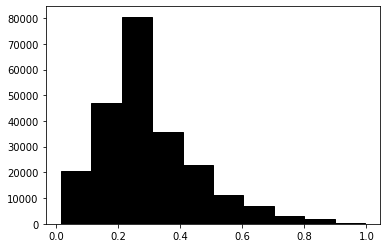

# Image Analysis San Salvador
By Fabiola Alba Vivar (Brown U) and Furkan Top (MIT)

We use Satellite Data to study Gang Presence in San Salvador. We obtained Google Earth Satellite Images from houses and neighborhoods inside and outside gang dominated areas of the city. We want to revise whether there are systematic differences between these areas using image analysis. We also use Machine Learning tools in order to predict if a neighborhood is gang dominated or not. 
 
## Context 
 
We study the city of San Salvador, El Salvador's capital. This city is located in the Boqueron Volcano Valley. Due to his very tropical climate and hilly topography, it is surrounded by green mountains and rural open space. Figure 1 shows a satellite image of the city. It is estimated to have almost 2 million habitats, increasing at a rate of 1.9 average percent per year since 1999. For more information, visit: http://www.atlasofurbanexpansion.org/cities/view/San\_Salvador

During the recent decades, the city have suffered the violence of two major gangs: MS-13 and 18th Street. Several parts of the city were completely dominated by these gangs, generating negative outcomes to its habitats. We used the data collected by Melnikov, Schmidt-Padilla and Sviatschi (2019), where they drawn the gang boundaries across the city. Aditionally, they surveyed over 2000 households in gang and non gang areas.The households were selected by dividing the census segments into 30 meter bins, denoting distance to gang territory. The distribution of the households are plotted in Figure 2.

We collected Google Earth Satellite images from each of the households included in the survey sample. Images collected are centered at the GPS location of each household and they were stored as 480x480 RGB files. In total, we collected 2314 images, where 54 percent of them belong to gang dominated area.

#### See the code on the R file: "PlottingBoundaries.R"

We processed the images in Python, and for each one we obtained a 480x480 3D matrix. Then, we re-scaled this data by transforming it into a grey scale and therefore we reduced it to a one-dimensional matrix. We can see  an example for a Gang and No Gang location and their respective collected data is plotted in a histogram.  

### Non Gang Dominated Area Example
 

### Gang Dominated Area Example
 

## Empirical Strategy

We want to study whether the images from Gang and Non Gang areas are systematically different. Melnikov, Schmidt-Padilla and Sviatschi (2019) find worse development outcomes inside gang-controlled neighborhoods (like fewer years of education, lower earnings, less
consumption of durable goods) and no differences in public goods (like schools and health availability). They also found that after the deportation of gang leaders, the locations with gang presence experienced significantly lower growth in luminosity than areas that were
not exposed to gangs.

From this evidence, we can expect that gang controlled area might have worse house conditions (i.e. smaller houses). It is also expected  to have infrastructure that is more suitable for crime (i.e. warehouses, more access to big roads,etc). Another hypothesis is that people might invest more inside their households than outside, in order not to call the attention of gangs. This means we can also no find any significant differences. 

Ideally, in a regular setting we could have different outcome variables and we test whether the variable 1=Gang (belonging to a Gang dominated area) is significant or not. However, when working with images, using something like linear regression, does not work. This is because the data from images is processed in more than 1 dimension. For this reason, we will use  alternative approaches.

### Wasserstein Distance
First, 

### Supporting Vector Machine

Support vector machines (using SVMs now on) is a method used for classification that belongs to the set of supervised learning methods. 
Its often used when the data has high dimensional spaces, like the case of images.
We estimated the parameters of 4 different models (each kernel type). The results suggests that all models predict with more than 50% accuracy on the test sample. 

 

#### See the code on the Python file: "ImageAnalysisSanSalvadorSVM.py"

### Convolutional Neural Network

Convolutional Neural Network (CNN) is a deep Learning algorithm which can take in an input (such and image, text, etc), assign weights and biases to various aspects/objects in the image and be able to differentiate or classify them. 

We tested several models, including one with regularization. Our best model was the one with two 2d Convolution Filter and two (L1 and L2) regularizers. We estimated this model using a Binary Crossentropy Loss Function.

Our results are the following:

 
 

#### See the code on the Python file: "ImageAnalysisSanSalvadorCNN.py"

